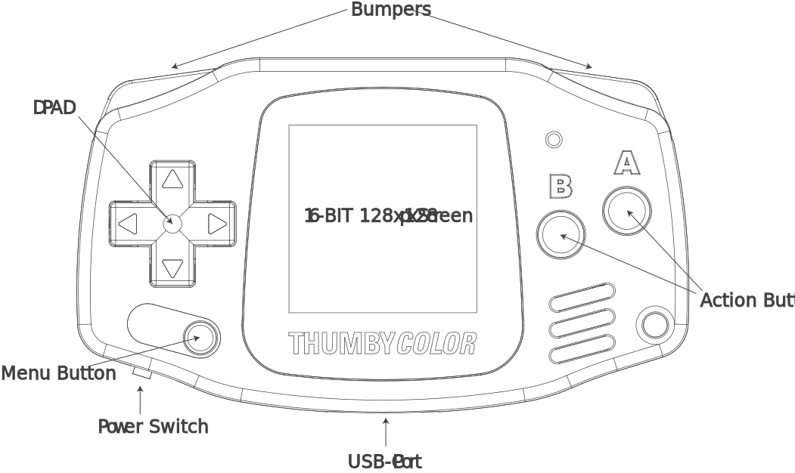
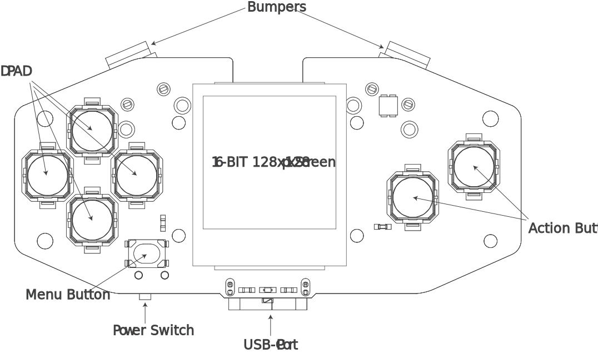

---
hide:
  - navigation
---

<h1>Thumby Color, a Tiny Playable Color Keychain by <a href="https://tinycircuits.com/" target="_blank" alt="TinyCircuits main website page"><b>TinyCircuits</b></a></h1>

<section>

<button class="buy-btn"><a href="https://www.google.com/url?q=https%3A%2F%2Fwww.kickstarter.com%2Fprojects%2Fkenburns%2Fthumby-color&sa=D&sntz=1&usg=AOvVaw26u2EY9JzmYGGObS01Pno1" style="color: white" target="_blank" alt="TinyCircuits Thumby product page on tinycircuits website"><b>Order Now</b></a></button>

<button class="disc-btn"><a href="https://discord.gg/vzf3wQXVvm"  style="color: white" target="_blank" alt="TinyCircuits Discord join link"><b>Join us on Discord</b></a></button>

</section>

---

<h2>Play & program using our MicroPython game engine</h2>

<a href="https://micropython.org/" target="_blank" alt="MicroPython documentation and site">**MicroPython**</a> is an implementation of Python optimized to run on small embedded devices, like Thumby Color. Together with our custom 2D/3D game engine, making games is easy!

---

## **Tech Specifications**: Thumby Color and Thumby Color Dev Board

* **Processor**: 150MHz ~ 300MHz Dual Core Raspberry Pi RP2350 Processor (with FPU)
* **Memory**: 520KiB SRAM
* **Storage**: 16MiB Flash (_partitioned as 1MiB firmware, 2MiB game scratch, and 13MiB filesystem_)
* **Screen**: 0.85" 128x128px 16-bit Backlit Color TFT LCD Display
* **Power**: Slide Switch, 110mAh Rechargeable LiPo Battery, ~2 Hours of Gameplay
* **Buttons**: 9 Tactile Buttons
    * 4 Direction Rocker DPAD
    * 2 A/B Action Buttons
    * 2 Shoulder Bumpers
    * 1 Menu Button
* **Audio**: 4kHz Magnetic Buzzer
* **Haptics**: DC 14000 MAXRPM 0.24g Weight Vibration Motor
* **Time Keeping**: Internal RTC Clock
* **Dimensions**: 51.6x30.0x11.6mm

---

## **Thumby Color Diagram**

## **Thumby Color Dev Board Diagram**

