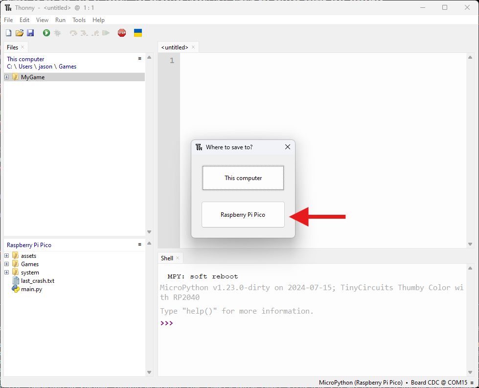
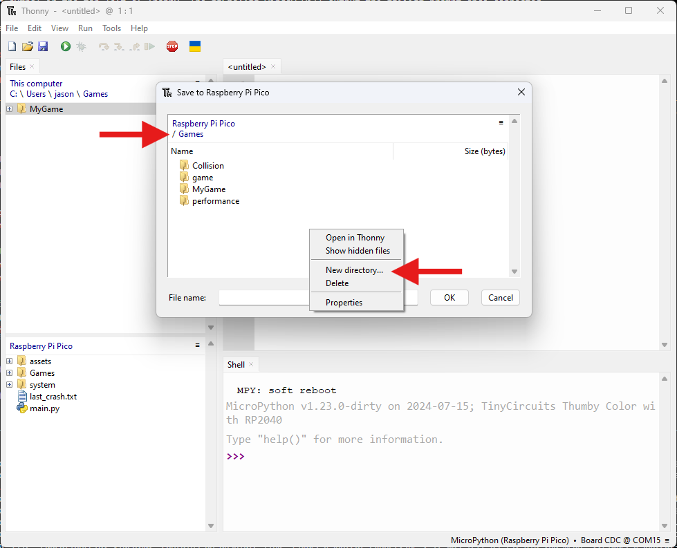
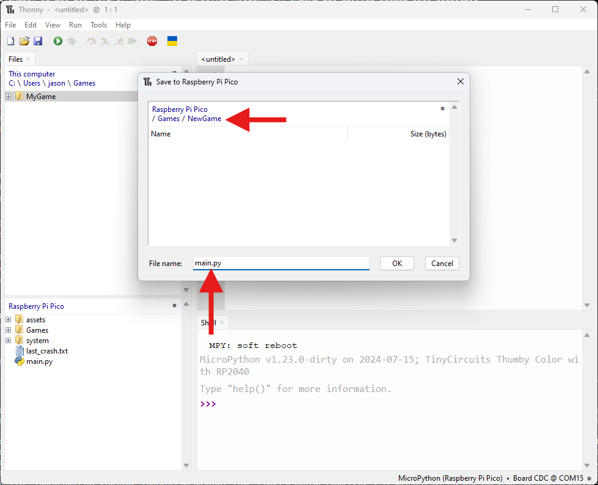

## Connect and First Save
First things first, make sure your **Thumby Color** or **Thumby Color Dev Board** is connected to your computer using a USB-C cable. Once physically connected, press the **red stop sign** symbol in the top left of Thonny. The **Shell** window will output the **>>>** prompt once connected.

Inside **Thonny**, left-click the **< untitled >** pane and then press **ctrl-s** and choose **Raspberry Pi Pico**:



Next, navigate into the **Games** folder by double left-clicking it, and then right-click anywhere and choose **New Directory...**


Choose any name for your game folder and then navigate into it. Name the file you're saving as **main.py** and press **OK**.


Now anytime you press **ctrl-s**, the file will be saved to the device.


# First Game
To create a very basic scene we need to:

* Import `engine_main` to set the engine up
* Import `engine` for starting or ticking
* Import the nodes we want and a camera
* Create the nodes
* Start the engine

```py
import engine_main
import engine
from engine_nodes import Rectangle2DNode, CameraNode

rectangle = Rectangle2DNode()
camera = CameraNode()

engine.start()
```


