This page will go through the steps to get started using **Thumby Color** or the **Thumby Color Dev Board** using the Thonny IDE.

## **Installing the Thonny IDE**
To edit code and upload files to your device, we'll use an application called Thonny.

Download and install Thonny for your platform <a href="https://thonny.org/" target="_blank" alt="View the RP2040 Arduino board package source">**here**</a> 

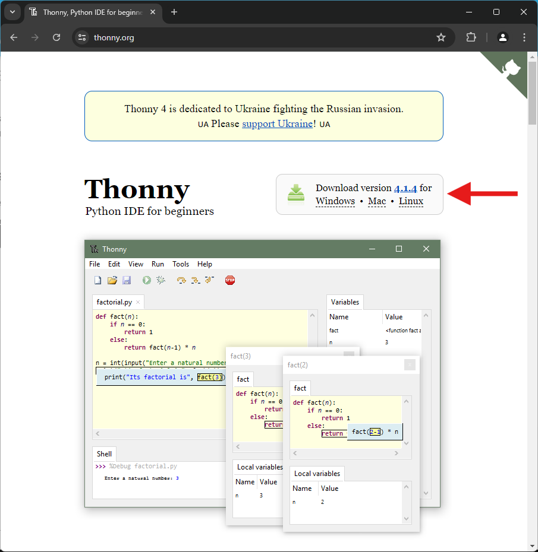

## **Configuring Thonny**
First, open Thonny using your OS application finder:

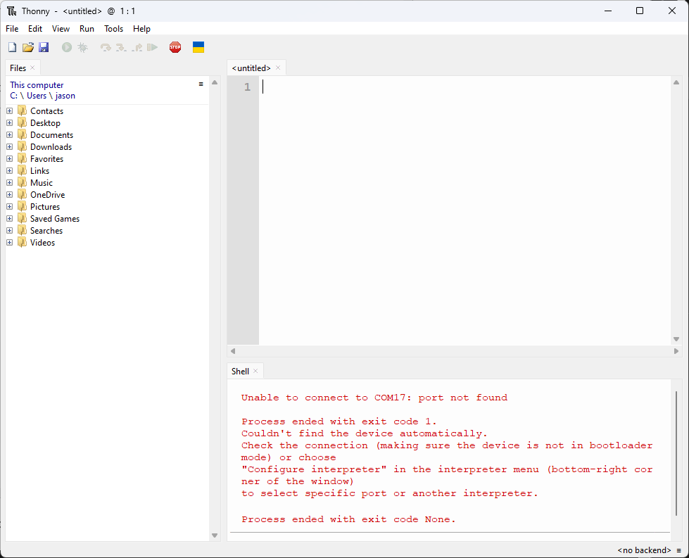

Next, go to **Tools > Options > Interpreter**:

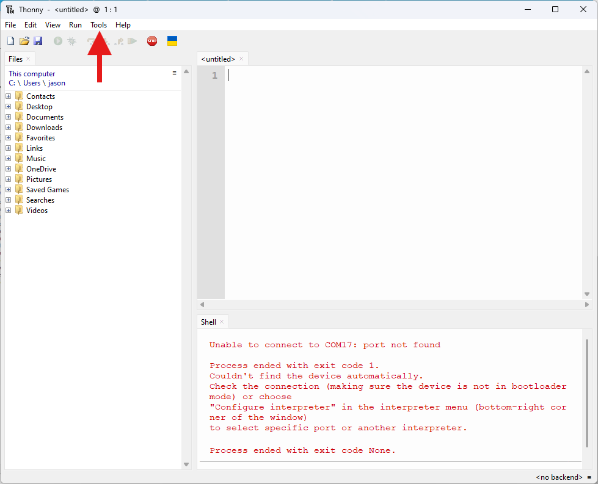
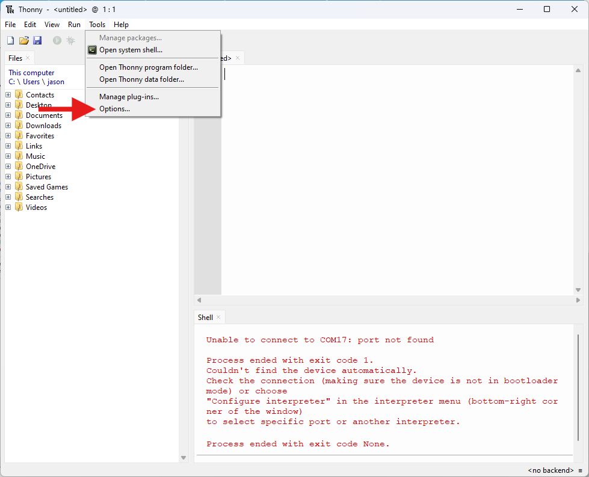
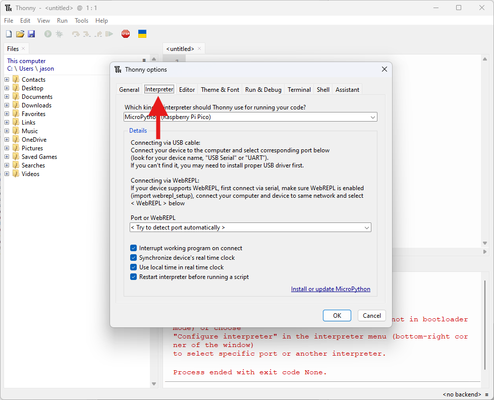

Once in the **Interpreter** menu, set the following:

* _Which kind of interpreter should Thonny use for running your code?_ -> **MicroPython (Raspberry Pi Pico)**
* _Port of WebREPL_ -> **< Try to detect port automatically >**
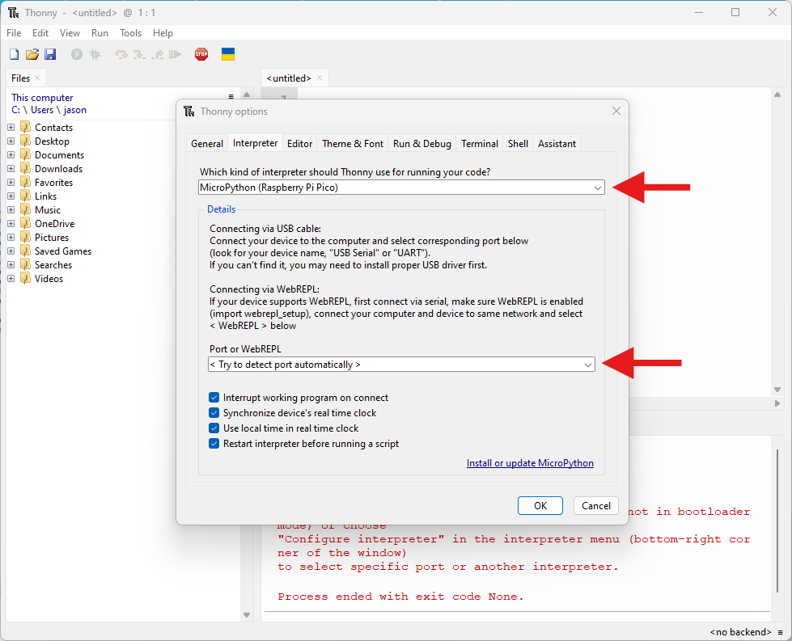

Exit all of those windows and Thonny is ready to use!

## **Using Thonny**
### Connecting
Plug your **Thumby Color** or **Thumby Color Dev Board** into your computer with a USB-C cable. Turn the device on by looking at the screen and sliding the power switch to the right.

Now that the device is on, open Thonny and left-click the **red stop sign** symbol in the upper left-hand corner to connect the device. The **Shell** window at the bottom will show **>>>** meaning it is connected (if you do not see the **Shell** pane, go to **View** and check **Shell**).
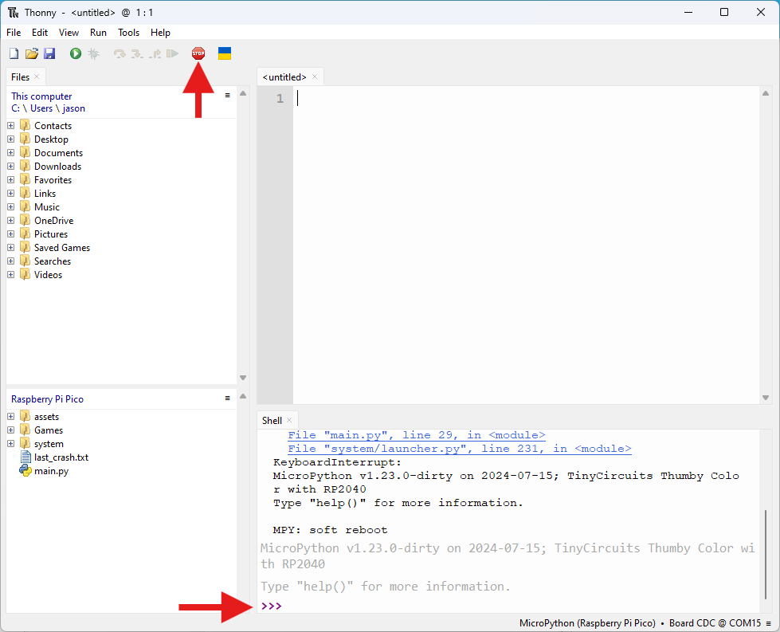

### Managing Files
#### File Panes
Inside Thonny, you will notice the two panes on the left show your computer files (upper left pane) and your device files (lower left pane). If you do not see the panes, go to **View** and check **Files**:

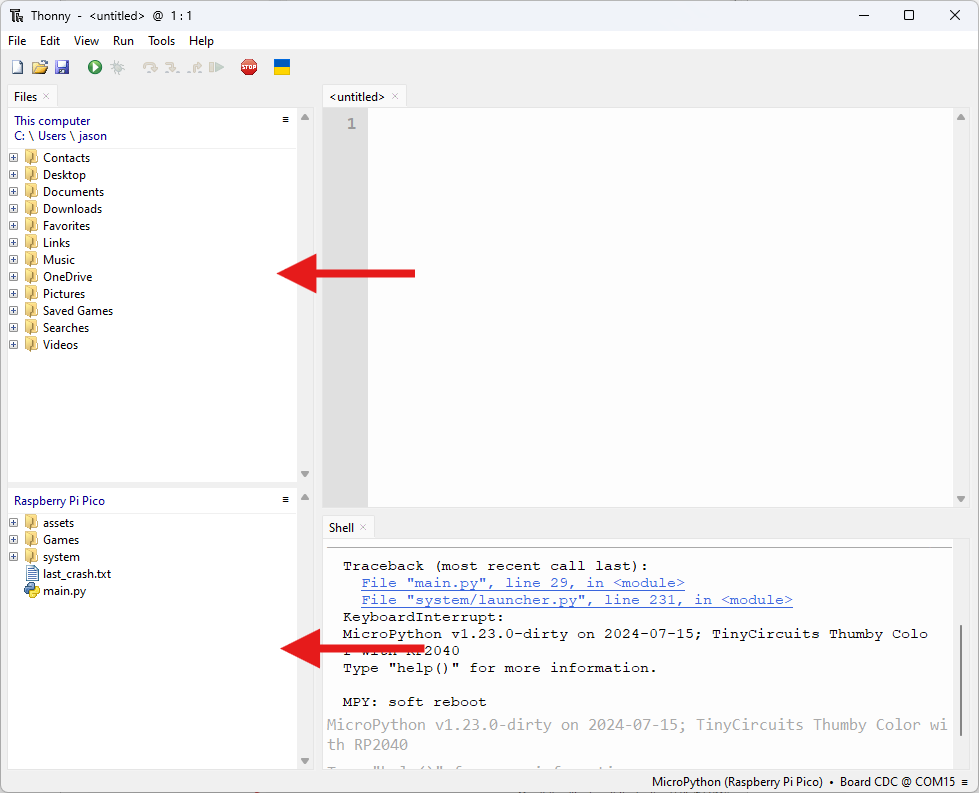

#### Uploading Files/Folders
In the lower left pane, double left-click folders to navigate until you reach a spot where you want upload a file or folder:
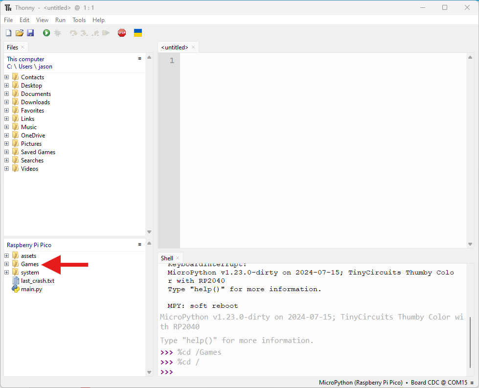

Now do the same in the upper left pane until you reach the file/folder you want to upload:
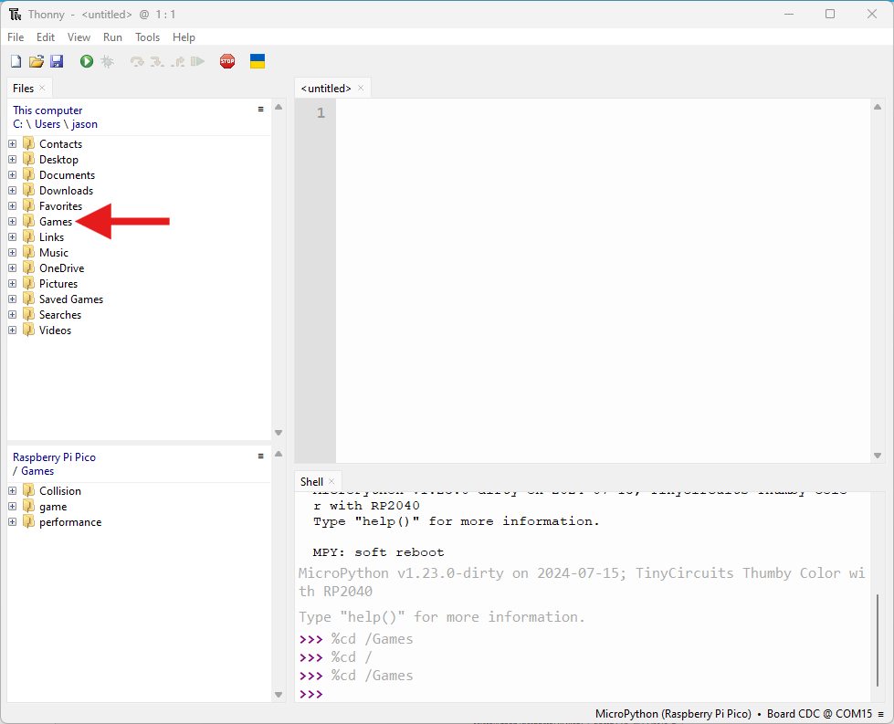

Right-click the item you want to upload and click **Upload to /Games**:
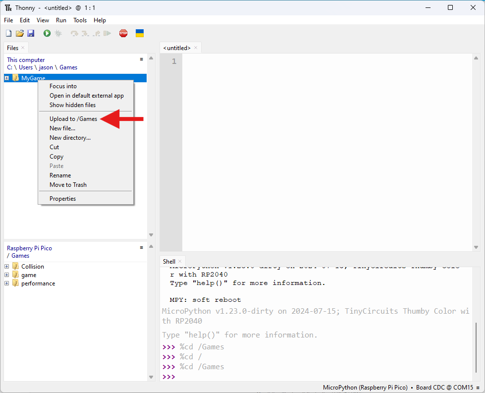

Wait while to upload transfers the files to the device:
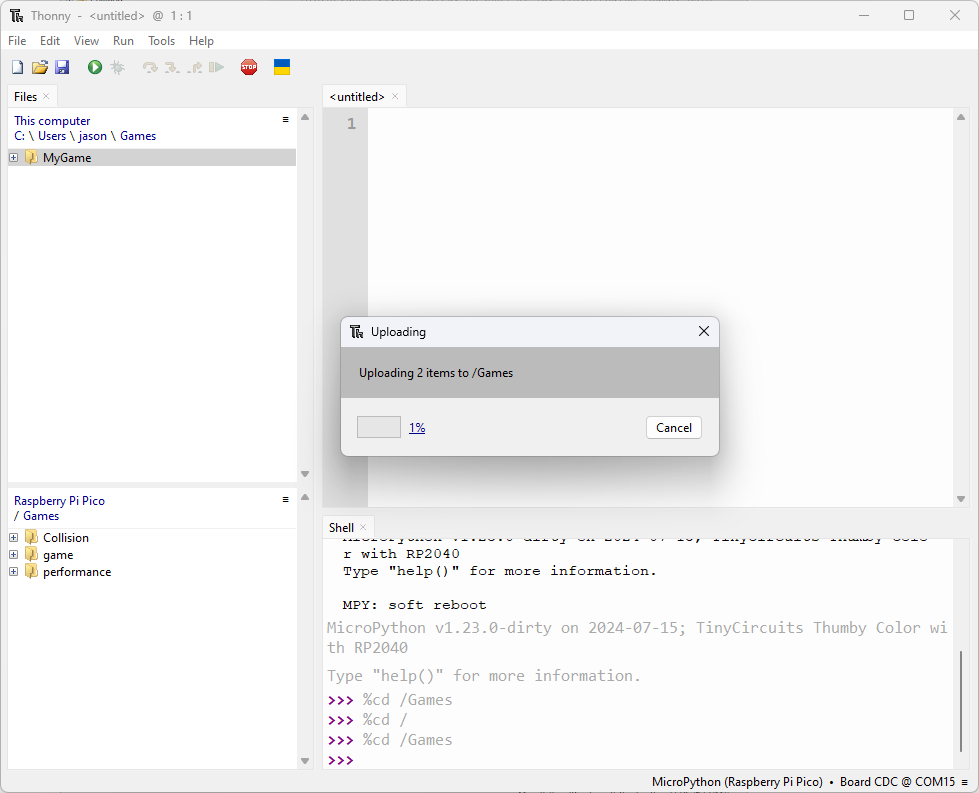

After the transfer is complete, navigate back out of folders by pressing the blue links in the pane titles:
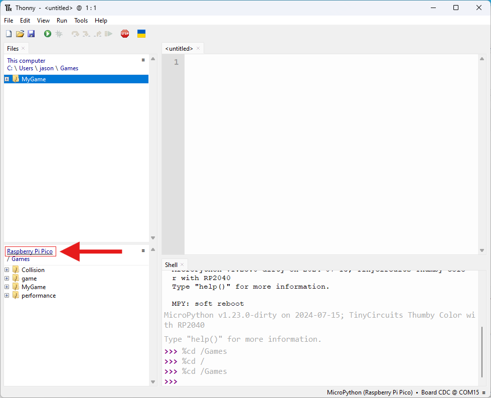

#### Downloading Files/Folders
The above works the opposite way: right-click files/folders in the lower left pane and click **Download to**

#### Deleting Files/Folders
Files and folders on the device can be deleted by right-clicking them in the lower left pane and choosing **Delete**

#### Creating Folders
In the lower left pane, right click anywhere and choose **New Directory...**